<!--
Long-WAM file attribution; existing upstream notices are retained below.
SPDX-FileCopyrightText: Copyright (c) 2026 NVIDIA CORPORATION & AFFILIATES. All rights reserved.
SPDX-License-Identifier: Apache-2.0
Provenance: Original Long-WAM implementation.
License texts and component notes: see THIRD_PARTY_NOTICES.md at the repository root.

Licensed under the Apache License, Version 2.0 (the "License");
you may not use this file except in compliance with the License.
You may obtain a copy of the License at

    http://www.apache.org/licenses/LICENSE-2.0

Unless required by applicable law or agreed to in writing, software
distributed under the License is distributed on an "AS IS" BASIS,
WITHOUT WARRANTIES OR CONDITIONS OF ANY KIND, either express or implied.
See the License for the specific language governing permissions and
limitations under the License.
End Long-WAM attribution.
-->

<h1 align="center">Long-WAM: Scaling the Context of World-Action Models</h1>

<p align="center">
  Wei Huang<sup>1,3,*</sup> &nbsp;·&nbsp;
  Bohan Zhang<sup>2,*</sup> &nbsp;·&nbsp;
  Chenzhi Liu<sup>3</sup> &nbsp;·&nbsp;
  Isabella Liu<sup>1,4</sup><br>
  Shuai Yang<sup>1</sup> &nbsp;·&nbsp;
  Weian Mao<sup>1</sup> &nbsp;·&nbsp;
  Luozhou Wang<sup>1</sup> &nbsp;·&nbsp;
  Yicheng Xiao<sup>3</sup><br>
  Weifeng Lin<sup>1</sup> &nbsp;·&nbsp;
  Qixin Hu<!-- Author confirmation pending: affiliation was not supplied. --> &nbsp;·&nbsp;
  Bryan Chu<sup>1</sup> &nbsp;·&nbsp;
  Sifei Liu<sup>1</sup><br>
  Jim (Linxi) Fan<sup>1</sup> &nbsp;·&nbsp;
  Xiaojuan Qi<sup>3</sup> &nbsp;·&nbsp;
  Song Han<sup>1,2</sup> &nbsp;·&nbsp;
  Yukang Chen<sup>1</sup>
</p>

<p align="center">
  <sup>1</sup>NVIDIA &nbsp;&nbsp;
  <sup>2</sup>MIT &nbsp;&nbsp;
  <sup>3</sup>HKU &nbsp;&nbsp;
  <sup>4</sup>UCSD<br>
  <sup>*</sup> Equal contribution.
</p>

<p align="center">
  <strong>Long-context world-action modeling with streaming visual memory.</strong>
</p>

<!-- Add the paper link when supplied. -->
<p align="center">
  <a href="https://github.com/NVlabs/LongLive/tree/long-wam-release/Long-WAM"></a>
  <a href="https://efficient-large-model.github.io/Long-WAM/"></a>
  <a href="https://huggingface.co/Efficient-Large-Model"></a>
  <a href="https://www.youtube.com/watch?v=sQGoMf6au1Y"></a>
  <a href="#quick-start"></a>
  <a href="LICENSE"></a>
</p>

## Demo video

<p align="center">
  <a href="https://www.youtube.com/watch?v=sQGoMf6au1Y">
    
  </a><br>
  <a href="https://www.youtube.com/watch?v=sQGoMf6au1Y"><strong>▶ Watch the Long-WAM video on YouTube</strong></a>
</p>

## Overview

Long-WAM connects long-video autoregressive modeling with robot action learning.
It provides portable YAML configs, training/evaluation scripts for five benchmarks,
and real-robot deployment interfaces.

| Stage | What is included | Start here |
| --- | --- | --- |
| **1 · Robot video pretraining** | LongLive 2.0 Robot autoregressive training and fixed-checkpoint video validation | [Stage 1 guide](stage1/README.md) |
| **2 · World-action learning** | Benchmark-specific training, streaming policy inference, and simulator evaluation | [Inference and evaluation](#inference-and-evaluation) |

> See [Verification](docs/VERIFICATION.md) for tested paths and known
> LIBERO/RoboTwin integration issues; full benchmark reproduction remains unverified.

## Contents

- [Checkpoints & Downloads](#checkpoints)
- [Quick Start & Installation](#quick-start)
- [Inference & Evaluation](#inference-and-evaluation)
- [Infra: Accelerated Inference & Robot Interfaces](#infra-accelerated-inference-and-robot-interfaces)
  - [Supported Hardware & Compilation](#supported-hardware-and-compilation)
  - [Install, Check & Run](#install-check-and-run)
  - [YAM, Franka & Unitree G1 Demos](#real-robot-deployment-demos)
- [Data Preparation](#data-preparation)
- [Training](#training)
  - [Benchmark Recipes](#benchmark-recipes)
  - [RoboCasa GR1 Context Scaling](#robocasa-gr1-context-scaling)
  - [Hardware Adaptation & Fine-tuning](#adapt-the-hardware-or-fine-tune-a-policy)
- [AR Video: LongLive 2.0 Robot](#ar-video-longlive-20-robot)
  - [Image-to-video Inference](#image-to-video-inference)
- [Agentic API + Long-WAM](#agentic-api--long-wam)
- [Documentation & Repository Layout](#documentation)
- [Paper & Citation](#paper-and-citation)
- [License](#license)
- [References & Acknowledgments](#references-and-acknowledgments)

## Checkpoints

Public checkpoints are hosted by
[Efficient-Large-Model (ELM)](https://huggingface.co/Efficient-Large-Model).
**Download → inference → evaluation**; no retraining required.

### Robot policies

| Model | Inference mode / use | Hugging Face | Download key |
| --- | --- | --- | --- |
| Long-WAM LIBERO | IDM | [Long-WAM-LIBERO-IDM](https://huggingface.co/Efficient-Large-Model/Long-WAM-LIBERO-IDM) | `libero_idm` |
| Long-WAM LIBERO | COD | [Long-WAM-LIBERO-COD](https://huggingface.co/Efficient-Large-Model/Long-WAM-LIBERO-COD) | `libero_cod` |
| Long-WAM RoboTwin 2.0 | IDM | [Long-WAM-RoboTwin2.0-IDM](https://huggingface.co/Efficient-Large-Model/Long-WAM-RoboTwin2.0-IDM) | `robotwin2_idm` |
| Long-WAM RoboTwin 2.0 | COD | [Long-WAM-RoboTwin2.0-COD](https://huggingface.co/Efficient-Large-Model/Long-WAM-RoboTwin2.0-COD) | `robotwin2_cod` |
| Long-WAM RoboCasa365 | 2.4-second context | [Long-WAM-RoboCasa365](https://huggingface.co/Efficient-Large-Model/Long-WAM-RoboCasa365) | `robocasa365` |
| Long-WAM YAM | Bimanual YAM pretraining on ABC 130K | [Long-WAM-YAM](https://huggingface.co/Efficient-Large-Model/Long-WAM-YAM) | `yam` |

**COD** uses `inference_mode=codenoise` with matching weights/config.
YAM is a pretraining release; see its model card for the camera/action interface.

### RoboCasa GR1: five history lengths

All variants use 20-Hz control and a 16-step action chunk.

| History | Past control steps | Clean latent frames | Hugging Face | Download key |
| --- | ---: | ---: | --- | --- |
| 0 s | P0 | 1 | [Long-WAM-RoboCasa-GR1-0s](https://huggingface.co/Efficient-Large-Model/Long-WAM-RoboCasa-GR1-0s) | `robocasa_gr1_p0` |
| 2.4 s | P48 | 4 | [Long-WAM-RoboCasa-GR1-2.4s](https://huggingface.co/Efficient-Large-Model/Long-WAM-RoboCasa-GR1-2.4s) | `robocasa_gr1_p48` |
| 4.8 s | P96 | 7 | [Long-WAM-RoboCasa-GR1-4.8s](https://huggingface.co/Efficient-Large-Model/Long-WAM-RoboCasa-GR1-4.8s) | `robocasa_gr1_p96` |
| 9.6 s | P192 | 13 | [Long-WAM-RoboCasa-GR1-9.6s](https://huggingface.co/Efficient-Large-Model/Long-WAM-RoboCasa-GR1-9.6s) | `robocasa_gr1_p192` |
| 19.2 s | P384 | 25 | [Long-WAM-RoboCasa-GR1-19.2s](https://huggingface.co/Efficient-Large-Model/Long-WAM-RoboCasa-GR1-19.2s) | `robocasa_gr1_p384` |

P0 uses only the current frame; other variants add the listed history.
Use matching weights and config.

### LongLive 2.0 Robot video models

| Model | Training sequence lengths | Hugging Face | Download key |
| --- | --- | --- | --- |
| Robot-S | Short sequences, within a few seconds | [LongLive2.0-Robot-S](https://huggingface.co/Efficient-Large-Model/LongLive2.0-Robot-S) | `stage1_robot_s` |
| Robot-M | Short and medium-length sequences | [LongLive2.0-Robot-M](https://huggingface.co/Efficient-Large-Model/LongLive2.0-Robot-M) | `stage1_robot_m` |

S/M denote sequence-length coverage, not model size. These are video generators;
see the [Stage 1 guide](stage1/README.md).

### Download a bundle

Use a download key above; revisions are pinned in
[`configs/checkpoints.yaml`](configs/checkpoints.yaml).

```bash
python scripts/download_checkpoint.py robocasa365 --output checkpoints/robocasa365
python scripts/download_checkpoint.py robocasa_gr1_p192 --output checkpoints/gr1-9.6s
# Optional integrity check after downloading a bundle.
(cd checkpoints/gr1-9.6s && sha256sum -c SHA256SUMS)
```

Policy bundles include `model.pt`, `config.yaml` and `dataset_stats.json`;
keep them together. Video bundles include weights, a model card and checksums.
VAE/text assets, GR1 text cache and simulators are installed separately.

## Quick start

Download **only Long-WAM**; the other LongLive projects are not required:
the current release branch is `long-wam-release`.

```bash
git clone --filter=blob:none --sparse --single-branch --branch long-wam-release --depth 1 https://github.com/NVlabs/LongLive.git
cd LongLive
git sparse-checkout set Long-WAM
cd Long-WAM
```

Partial clone fetches Git metadata and sparse checkout downloads this project's
files, plus the small shared root files—not the other projects' source or assets.
Run all commands below from **`LongLive/Long-WAM/`**, the independent project root.

### 1. Install the policy environment

Use Python ≥3.10 and compatible CUDA PyTorch
(policy target: 2.7.x; see [dependencies](pyproject.toml)).

```bash
# Deployment environment: LIBERO/RoboTwin/Domino and LeRobot control interfaces.
pip install -e '.[infra]'

# Use a SEPARATE environment for training and its pinned data stack:
# pip install -e '.[train,test]'
#
# RoboCasa GR1/365 socket serving without LeRobot only needs: pip install -e .

export LONGWAM_DATA_ROOT="$PWD/data"
export LONGWAM_CHECKPOINT_ROOT="$PWD/checkpoints"
export LONGWAM_MODEL_ROOT="$PWD/models"
export LONGWAM_OUTPUT_ROOT="$PWD/outputs"
```

Set the roots to your storage paths. Install simulators via the
[benchmark setup guide](docs/BENCHMARKS.md).

**Keep environments separate:** `.[infra]` requires `datasets` 4.x; `.[train]`
pins 3.6.0. Stage 1 also has its own environment. GR1 and RoboCasa365 use
incompatible `robocasa` packages; select each simulator with `simulator_python`.

### 2. Inspect a recipe without loading a model

```bash
bash scripts/robocasa365/eval.sh --dry-run
bash scripts/robocasa_gr1/train.sh context=p96 --dry-run
```

`--dry-run` checks configuration without loading models/data or using a GPU.

### 3. Evaluate a downloaded checkpoint

After installing the simulator and model assets:

```bash
python scripts/download_checkpoint.py robocasa365 --output checkpoints/robocasa365

bash scripts/robocasa365/eval.sh \
  checkpoint=checkpoints/robocasa365/model.pt \
  model_config=checkpoints/robocasa365/config.yaml \
  stats=checkpoints/robocasa365/dataset_stats.json \
  simulator_python=/path/to/robocasa-env/bin/python \
  output_dir=outputs/robocasa365-eval
```

Use the bundle's **inference config**, your simulator path and a fresh `output_dir`.

## Inference and evaluation

Edit [`configs/eval/`](configs/eval/) or pass `key=value` overrides.
Add `--dry-run` to inspect settings; rollout videos are off by default.

<details>
<summary><strong>LIBERO · IDM and COD (CodeDenoise)</strong></summary>

```bash
python scripts/download_checkpoint.py libero_idm --output checkpoints/libero-idm
bash scripts/libero/eval.sh inference_mode=idm \
  checkpoint=checkpoints/libero-idm/model.pt \
  model_config=checkpoints/libero-idm/config.yaml \
  stats=checkpoints/libero-idm/dataset_stats.json \
  output_dir=outputs/libero-idm-eval
```

For COD, use `libero_cod` and `inference_mode=codenoise` with its matching bundle.
Covers Spatial, Object, Goal and Long.

Configuration: [`configs/eval/libero.yaml`](configs/eval/libero.yaml).

</details>

<details>
<summary><strong>RoboTwin 2.0 · IDM and COD (CodeDenoise)</strong></summary>

```bash
python scripts/download_checkpoint.py robotwin2_cod --output checkpoints/robotwin2-cod
bash scripts/robotwin2/eval.sh inference_mode=codenoise \
  checkpoint=checkpoints/robotwin2-cod/model.pt \
  model_config=checkpoints/robotwin2-cod/config.yaml \
  stats=checkpoints/robotwin2-cod/dataset_stats.json \
  simulator_root=/path/to/RoboTwin \
  output_dir=outputs/robotwin-codenoise-eval
```

For IDM, use `robotwin2_idm` and `inference_mode=idm` with its matching bundle.
Covers clean/randomized settings; follow the [simulator setup](docs/BENCHMARKS.md).

Configuration: [`configs/eval/robotwin2.yaml`](configs/eval/robotwin2.yaml).

</details>

<details>
<summary><strong>Domino · OOD and fine-tuned evaluation</strong></summary>

```bash
bash scripts/domino/eval.sh \
  checkpoint=/path/to/policy.pt \
  model_config=/path/to/resolved-config.yaml \
  stats=/path/to/stats.json \
  simulator_root=/path/to/DOMINO \
  output_dir=outputs/domino-eval
```

OOD uses a RoboTwin policy without Domino fine-tuning; fine-tuned evaluation
uses a Domino-trained policy. Compare within each setting using identical
tasks/seeds/episodes. Reports SR/MS.

Configuration: [`configs/eval/domino.yaml`](configs/eval/domino.yaml).

</details>

<details>
<summary><strong>RoboCasa GR1 · History-specific checkpoints</strong></summary>

```bash
python scripts/download_checkpoint.py robocasa_gr1_p384 --output checkpoints/gr1-19.2s
bash scripts/robocasa_gr1/eval.sh expected_history=384 \
  checkpoint=checkpoints/gr1-19.2s/model.pt \
  model_config=checkpoints/gr1-19.2s/config.yaml \
  stats=checkpoints/gr1-19.2s/dataset_stats.json \
  text_cache=/path/to/text_cache \
  simulator_python=/path/to/gr1-env/bin/python \
  output_dir=outputs/gr1-p384-eval
```

Set `expected_history` to `0`, `48`, `96`, `192` or `384` and use the matching
bundle/text cache. This flag checks history; it does not resize memory.

Configuration: [`configs/eval/robocasa_gr1.yaml`](configs/eval/robocasa_gr1.yaml).

</details>

<details>
<summary><strong>RoboCasa365 · Target50</strong></summary>

Use [Quick start](#3-evaluate-a-downloaded-checkpoint).
Defaults: `task_set=target50 split=pretrain episodes=50 env_seed=7`.
The [Agentic experiment](#agentic-api--long-wam) uses a separate protocol.

Configuration: [`configs/eval/robocasa365.yaml`](configs/eval/robocasa365.yaml).

</details>

### Default evaluation protocols

| Benchmark | Coverage | Seed / reset protocol | Action horizon / executed prefix |
| --- | --- | --- | --- |
| LIBERO | 4 suites × 10 tasks × 50 episodes | Seed 1 | 80 / 10 |
| RoboTwin 2.0 | 50 tasks × clean/randomized × 100 episodes | Native clean/randomized protocol | 32 / 24 |
| Domino | 35 level-1 tasks × 5 episodes | Seed 41 | 32 / 24 |
| RoboCasa GR1 | 24 tasks × 10 episodes; 5 environments | Recorded unseeded resets | 16 / 16 |
| RoboCasa365 | Target50 × 50 episodes; pretrain split | Environment seed 7 | 32 / 32 |

These are project defaults; checkpoint-specific metadata takes precedence.
LIBERO uses 20 action-denoising steps; others use 10. IDM adds 4 partial
video-denoising steps.

### Denoising modes and streaming history

| Mode | Inference behavior | Public benchmark variants |
| --- | --- | --- |
| **IDM** | Partial video denoising, then conditioned action denoising | Default benchmark recipes |
| **CodeDenoise** | Joint video/action denoising | LIBERO and RoboTwin 2.0 |

Match the checkpoint's denoising mode and context. `P` counts raw control steps
(GR1: P48 = 2.4 s); startup history repeats the oldest observation.

GR1/365 evaluation manages the policy server automatically. For custom clients,
use [`scripts/infer.sh`](scripts/infer.sh) with the same bundle arguments.

## Infra: accelerated inference and robot interfaces

`longwam.runtime` provides sync/async inference, streaming VAE and accelerated
hardware backends. See the [infra guide](infra/README.md).

### Supported hardware and compilation

| Device | GPU compute capability | Compile on the target device | Evaluation setting |
| --- | --- | --- | --- |
| NVIDIA GeForce RTX 5090 | 12.0 | `longwam build rtx5090` | `hardware=rtx5090` |
| NVIDIA DGX Spark | 12.1 | `longwam build spark` | `hardware=spark` |
| NVIDIA Jetson AGX Thor | 11.0 | `longwam build thor` | `hardware=thor` |

Acceleration uses **NVFP4 video / BF16 actions and KV**. Build on the target
device with compatible PyTorch, CUDA and C++ tools; follow the
[platform instructions](infra/README.md#build), especially on Spark/Thor.

### Install, check and run

```bash
# In a separate deployment environment:
pip install -e '.[infra,native]'

# Add --check-only to validate patches without compiling or requiring a GPU.
longwam build rtx5090 --check-only
longwam build spark --check-only
longwam build thor --check-only

# Inspect an async recipe without loading weights or starting a simulator.
longwam eval libero --dry-run execution=async \
  action_horizon=32 execute_steps=24 trigger_stride=16 streaming_vae=true
```

Remove `--check-only` to compile; select `hardware=<target>` for inference.
`hardware=reference` needs no native build. Python entry point:
`from longwam.runtime import create_policy` (LeRobot `reset` / `select_action`).

Async is opt-in; preserve the benchmark settings for reproduction. GR1/365
retain socket inference without these edge backends. Checks above validate
configuration/patches, not device performance.

### Real-robot deployment demos

YAM, Franka and G1 share `create_policy` and the existing infra backends.

| G1 · Dynamic cup stacking (1×) | G1 · Moving-cup grasping (1×) |
| --- | --- |
| [](https://efficient-large-model.github.io/Long-WAM/#demos) | [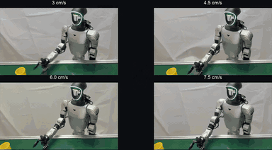](https://efficient-large-model.github.io/Long-WAM/#demos) |

**YAM · Bowl stacking and brick sorting (2×)**

[](https://efficient-large-model.github.io/Long-WAM/#demos)

<details>
<summary>G1 runtime comparisons (1×)</summary>

**Synchronous execution vs. accelerated infra**

[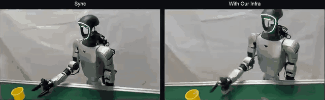](https://efficient-large-model.github.io/Long-WAM/#demos)

**Synchronous (top) vs. asynchronous (bottom), across four speeds**

[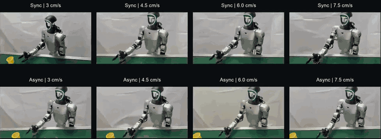](https://efficient-large-model.github.io/Long-WAM/#demos)

</details>

Real-robot recordings from the [project page](https://efficient-large-model.github.io/Long-WAM/#demos);
click a GIF to watch on the project page.

| Robot | Supported policy interface | Deployment configuration | Inspect without hardware |
| --- | --- | --- | --- |
| YAM | 14D bimanual state/action; top and two wrist cameras | [yam.yaml](configs/deploy/yam.yaml) | `longwam deploy yam --dry-run` |
| Franka | 8D state with 7D Cartesian-delta/gripper or 8D joint/gripper actions | [franka.yaml](configs/deploy/franka.yaml) | `longwam deploy franka --dry-run` |
| Unitree G1 + Dex1 | 16D dual-arm/three-camera or 8D right-arm/two-camera manipulation | [g1.yaml](configs/deploy/g1.yaml) | `longwam deploy g1 --dry-run` |

**Train on your own robot/task data**, then supply matching weights, model config
and statistics. Deployment checkpoint paths are **blank**; no public model is selected.
Provide a calibrated driver (G1 includes an optional `ial_g1d` bridge wrapper).

```bash
# Fill a copy of the robot YAML with your own policy bundle and calibrated driver.
longwam deploy g1 --config /path/to/your-g1.yaml --dry-run

# Read observations and run your policy, but do not arm or send robot commands.
longwam deploy g1 --config /path/to/your-g1.yaml
```

Default: read-only inference, **no robot commands**. Motion requires explicit
enablement, calibrated limits and a working emergency stop. These examples have
offline tests, not new physical-robot validation.
See the [deployment guide](infra/README.md#real-robot-deployment-demos).

## Data preparation

Evaluation needs the policy bundle, model/simulator assets and released statistics;
training demonstrations are not required.

| Benchmark | Training data used by this release | Preparation |
| --- | --- | --- |
| LIBERO | Four LeRobot suites: Spatial, Object, Goal, Long | [Download and directory layout](docs/DATA.md#libero) |
| RoboTwin 2.0 | Recorded RoboTwin 2.0 LeRobot release | [Download and archive extraction](docs/DATA.md#robotwin-20) |
| Domino | Domino + RoboTwin replay, sampled 50:50 | [Subset selection and conversion](docs/DATA.md#domino) |
| RoboCasa GR1 | Good Teleop release; 24 tasks / 24,000 demos at 20 Hz | [Pinned dataset and statistics](docs/DATA.md#robocasa-gr1-use-the-good-teleop-release) |
| RoboCasa365 | Human300; 100 demos/task | [Download, selection and statistics](docs/DATA.md#robocasa365) |

```bash
python scripts/download_data.py libero --output data/downloads/libero
```

Follow [`docs/DATA.md`](docs/DATA.md) for extraction, layouts, statistics and
text caches. GR1 requires the good Teleop release; Domino requires prepared
LeRobot data.

## Training

Each benchmark has its own `train.sh` and `eval.sh`. Prepare data, text embeddings
and initialization weights; select variants with `context=` or `denoising=`.

### Benchmark recipes

| Benchmark / launcher | Default GPUs × batch/GPU × accumulation | Global batch | Peak LR | Training length | History / action chunk |
| --- | --- | --- | --- | --- | --- |
| [LIBERO](scripts/libero/train.sh) | 8 × 8 × 2 | 128 | 1e-4 | 10 epochs | P48 / 32 |
| [RoboTwin 2.0](scripts/robotwin2/train.sh) | 8 × 16 × 8 | 1024 | 1e-4 | 5 epochs | P48 / 32 |
| [Domino](scripts/domino/train.sh) | 8 × 16 × 8 | 1024 | 3e-6 | 300 updates | P48 / 32 |
| [RoboCasa GR1](scripts/robocasa_gr1/train.sh) | 16 × 30 × 1; P768 below | 480 | 3e-5 | 30K updates | Selected P / 16 |
| [RoboCasa365](scripts/robocasa365/train.sh) | 16 × 16 × 1 | 256 | 1e-4 | Fresh 100K updates | P48 / 32 |

All recipes use BF16, seed 42 and gradient clipping 1.0.
Exact schedules and initialization: [training guide](docs/TRAINING.md).

```bash
# Inspect the 100K recipe.
bash scripts/robocasa365/train.sh --dry-run

# Start training after preparing the required data and initializers.
bash scripts/robocasa365/train.sh output_dir=outputs/robocasa365-100k

# LIBERO and RoboTwin support both training regimes.
bash scripts/libero/train.sh denoising=idm --dry-run
bash scripts/robotwin2/train.sh denoising=codenoise --dry-run
```

For Domino, set `LONGWAM_ROBOTWIN_CHECKPOINT` to the full RoboTwin initializer.

### RoboCasa GR1 context scaling

All six contexts support training/inference with the same Teleop data,
30K updates, H16 action chunk and global batch 480.

| Context | History at 20 Hz | Raw / sampled training frames | Batch/GPU × accumulation at 16 GPUs |
| --- | --- | --- | --- |
| `context=p0` | 0 s | 33 / 9 | 30 × 1 |
| `context=p48` | 2.4 s | 81 / 21 | 30 × 1 |
| `context=p96` | 4.8 s | 129 / 33 | 30 × 1 |
| `context=p192` | 9.6 s | 225 / 57 | 30 × 1 |
| `context=p384` **(default)** | 19.2 s | 417 / 105 | 30 × 1 |
| `context=p768` | 38.4 s | 801 / 201 | 6 × 5 |

Frames count the full training window. [Context configs](configs/context/)
update both the data window and model.

```bash
bash scripts/robocasa_gr1/train.sh context=p384 --dry-run

# Robot-video initialization: change only the video expert.
bash scripts/robocasa_gr1/train.sh context=p192 \
  model.longlive_video_weights=/path/to/LongLive-2.0-Robot.pt \
  output_dir=outputs/gr1-p192-robot
```

Replace only the video expert; retain GR1's action architecture.

### Adapt the hardware or fine-tune a policy

Keep global batch = GPU workers × batch/GPU × accumulation.
For GR1 on four GPUs (global batch 480):

```bash
NPROC_PER_NODE=4 bash scripts/robocasa_gr1/train.sh context=p96 --dry-run \
  batch_size=15 gradient_accumulation_steps=8
```

`resume=/path/to/weights.pt` starts a new optimization run from policy weights;
a training-state directory restores optimizer/scheduler/data state.
Use matching model/data configs; see [multi-GPU and resume details](docs/TRAINING.md).

## AR video: LongLive 2.0 Robot

Based on [LongLive 2.0](https://github.com/NVlabs/LongLive/tree/main/LongLive2.0),
with separate training and video-validation launchers in [`stage1/`](stage1/README.md).
Use its own environment. Recorded training uses **128 workers**; validation uses 8 GPUs.

| Shoe → container (1×) | Bun → steamer (1×) | Lid → pan (1×) |
| --- | --- | --- |
| [](https://efficient-large-model.github.io/Long-WAM/#demos) | [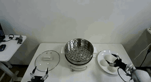](https://efficient-large-model.github.io/Long-WAM/#demos) | [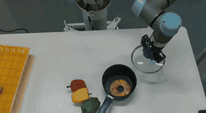](https://efficient-large-model.github.io/Long-WAM/#demos) |
| **Pour water (1×)** | **Fold clothing (2×)** | **Empty measuring cup (1×)** |
| [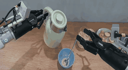](https://efficient-large-model.github.io/Long-WAM/#demos) | [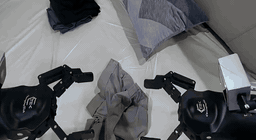](https://efficient-large-model.github.io/Long-WAM/#demos) | [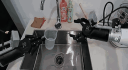](https://efficient-large-model.github.io/Long-WAM/#demos) |

Generated from an image and instruction, **not executed robot rollouts**.
Click a GIF to watch on the [project page](https://efficient-large-model.github.io/Long-WAM/#demos).

### Image-to-video inference

Use a Robot-S checkpoint or your own compatible video generator.
Seven RGB first frames and their original instructions are bundled:

| `short_00` · Bun → steamer | `short_04` · Lid → pan | `long_00` · Shoe → container |
| --- | --- | --- |
| 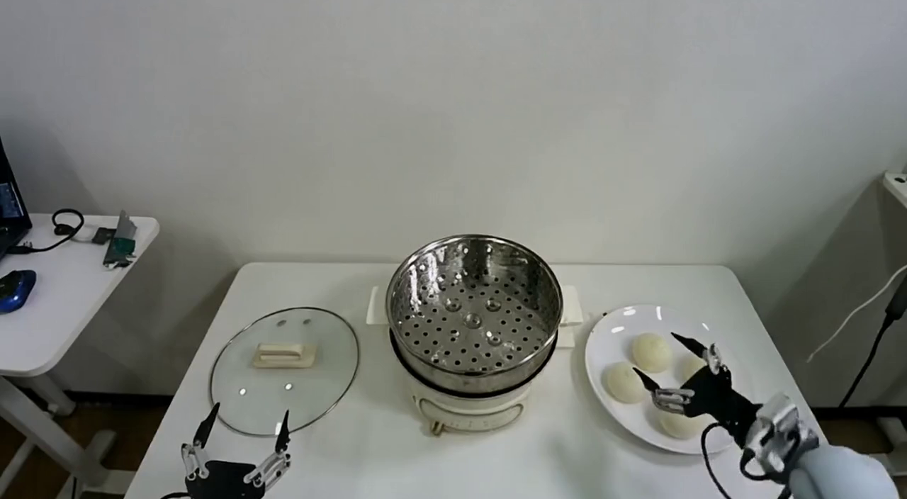 | 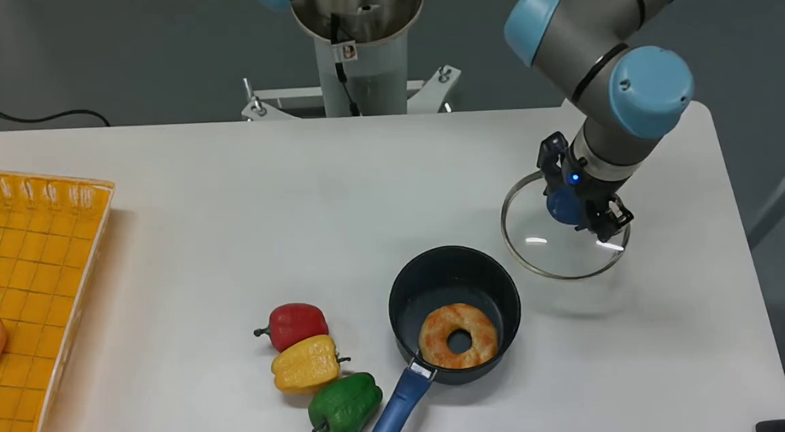 | 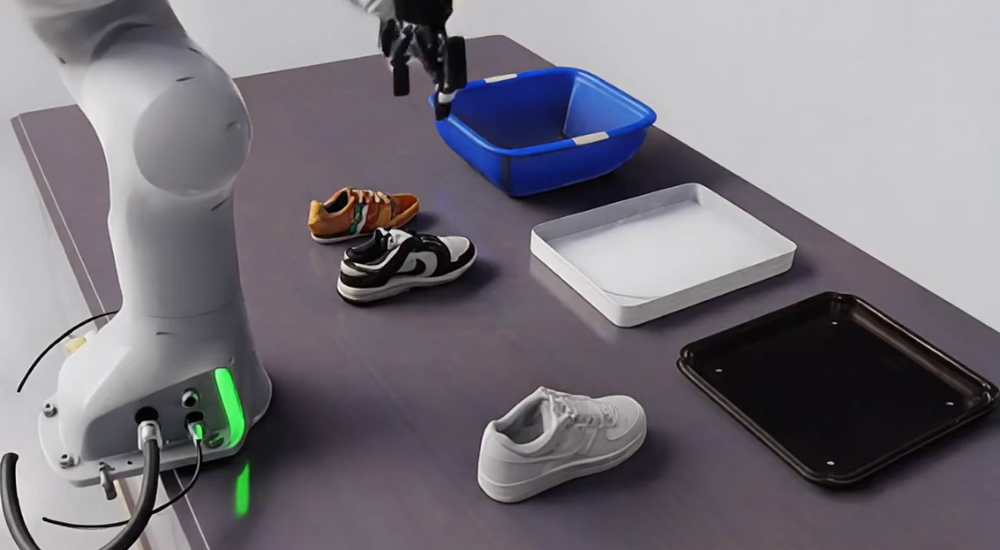 |

```bash
bash stage1/infer.sh --example all --dry-run
bash stage1/infer.sh --example short_00 \
  --checkpoint checkpoints/robot-s/model.pt --assets-root /path/to/video-assets \
  --output-dir outputs/video-demo
```

Output: `outputs/video-demo/short_00.mp4`. Uses 50 steps, CFG 3 and 24 FPS.
For installation, downloads and your own `--image` / `--prompt`, see the
[inference guide](stage1/README.md#image-to-video-inference).
Sample images: [RoVid-X, CC-BY-4.0](https://huggingface.co/datasets/DAGroup-PKU/RoVid-X).

### Video training and validation

```bash
# CPU-only planning; does not launch distributed training or validation.
export LONGWAM_VIDEO_DATA_ROOT=/path/to/robot-video-data
export LONGWAM_VIDEO_INDEX_CACHE=/path/to/robot-video-index
bash stage1/train.sh --stage S --output outputs/video-S \
  --assets-root /path/to/video-assets --generator /path/to/initial-generator.pt --plan
bash stage1/eval.sh --stage S --training-step 28602 \
  --generator /path/to/S/model.pt --assets-root /path/to/video-assets \
  --output outputs/video-S-validation --plan
```

`--plan` checks settings without launching jobs. For data, curriculum and real-run
commands, see the [Stage 1 guide](stage1/README.md); weights are listed [above](#checkpoints).

## Agentic API + Long-WAM

[`longwam.agentic`](src/longwam/agentic) provides a reusable model/tool runtime.
The [RoboCasa365 adapter](src/longwam/benchmarks/robocasa/agentic) adds instruction
decomposition and action review at inference time. Codex defaults:
`gpt-6-astra` / `xhigh`; model and effort are configurable.

```bash
bash scripts/robocasa365/eval.sh --agentic --dry-run
# Select another exact Codex model ID without changing the framework:
bash scripts/robocasa365/eval.sh --agentic --dry-run \
  agentic.model=YOUR_EXACT_CODEX_MODEL_ID agentic.effort=high
```

Protocol: **50 tasks × 5 episodes**, pretrain split, seed 7; use 5 episodes/task
for student-only comparisons. Live runs require model access, observation-sharing
consent and a token budget. Dry-runs make no model calls.
Authenticate with your own account/key; no credentials are included.
See [configuration and new adapters](docs/AGENTIC.md).

## Documentation

| Guide | Contents |
| --- | --- |
| [Benchmark setup](docs/BENCHMARKS.md) | Pinned simulators, compatibility patches and external prerequisites |
| [Data preparation](docs/DATA.md) | Downloads, directory layouts, subsets, statistics and text caches |
| [Training recipes](docs/TRAINING.md) | Exact parameters, GR1 scaling, initializers, resume and multi-GPU launch |
| [Stage 1](stage1/README.md) | LongLive 2.0 Robot training and long-video validation |
| [Agentic API](docs/AGENTIC.md) | Configurable Codex models, benchmark adapters and RoboCasa365 hybrid inference |
| [Infra](infra/README.md) | Accelerated inference, device builds, async control and LeRobot/robot interfaces |
| [Verification](docs/VERIFICATION.md) | CPU regression checks and outstanding end-to-end validation |
| [Import notes](docs/MERGE.md) | Source provenance and intentionally retained functionality |

### Repository layout

```text
Long-WAM/
├── configs/          # Benchmark recipes, GR1 contexts and denoising modes
├── scripts/          # Shared helpers + one train/eval pair per benchmark
├── infra/            # Deployment guide and hardware/runtime integration
├── src/longwam/      # Models, training, data and benchmark adapters
├── stage1/           # LongLive 2.0 Robot curriculum and video validation
├── third_party/      # Attributed FourOverSix/CUTLASS build sources; no compiled artifacts
├── tools/            # Reusable data preparation and weight conversion
├── tests/            # CPU regression tests
└── docs/             # Detailed setup and reproduction guides
```

## Paper and citation

**Long-WAM: Scaling the Context of World-Action Models**

<!-- Add the canonical paper URL and official BibTeX when supplied.
     Do not infer an arXiv identifier, venue or year. -->

## License

Long-WAM is released under [Apache 2.0](LICENSE).
Third-party components retain their [original licenses](THIRD_PARTY_NOTICES.md).

## References and acknowledgments

We thank [FastWAM](https://github.com/yuantianyuan01/FastWAM) for the foundation
of parts of the model/data implementation. **Long-WAM is independently maintained**
with its own interfaces and no runtime dependency on the FastWAM framework.

We also acknowledge [LongLive 2.0](https://github.com/NVlabs/LongLive/tree/main/LongLive2.0), Wan,
LeRobot, and the LIBERO, RoboTwin 2.0, Domino, RoboCasa GR1 and RoboCasa benchmark
teams. External models, datasets and simulator assets retain their own terms.
