<div align="center">

# LongLive-Plug
### Once-for-All Distillation for Video Generation

**Distill once on a base model. Plug into compatible downstream models.**

Shuai Yang<sup>&#42;</sup>, Luozhou Wang<sup>&#42;</sup>, Wei Huang, ZhiFei Chen,<br>
Bohan Zhang, Xiao Fu, Qianli Ma, Chen-Hsuan Lin,<br>
Weian Mao, Bryan Chu, Song Han, Yukang Chen

**NVIDIA** · <sup>&#42;</sup>Equal contribution


[](https://github.com/NVlabs/LongLive/tree/main/LongLive-Plug)
[](https://huggingface.co/collections/Perflow-Shuai/reproduce-6aba47aafb31d5ee159f45f5)
[](https://nvlabs.github.io/LongLive/LongLive-Plug/)
[](https://youtu.be/pXNrJvBZvZU)

</div>

## 💡 TL;DR

**LongLive-Plug distills reusable capabilities into LoRA adapters once per backbone family, then transfers them to compatible downstream models without target-specific training.** It supports single-pass classifier-free guidance (CFG), few-step sampling, and long-context error correction for causal autoregressive generation.

<p align="center">
  <a href="https://youtu.be/pXNrJvBZvZU"></a><br>
  <em>Watch LongLive-Plug on YouTube.</em>
</p>

[Supported backbones](#supported-backbones) · [Highlights](#highlights) · [Introduction](#introduction) · [Getting started](#getting-started) · [Video gallery](#video-gallery) · [Qualitative results](#qualitative-results) · [Citation](#citation)

## Supported backbones

**LongLive-Plug currently supports three backbone families:**

1. **Wan2.1-14B**
2. **Wan2.2-TI2V-5B**
3. **MiniMax-H3**

Model downloads are available in the [Hugging Face collection](https://huggingface.co/collections/Perflow-Shuai/reproduce-6aba47aafb31d5ee159f45f5). **Training code for MiniMax-H3 will be released later.**

Adapters are trained separately for each backbone and reused across compatible downstream models within that family. The video gallery below shows **five selected downstream examples per backbone**.

## News

- **2026.09.28** — We release LongLive-Plug training and inference code with four recipes covering CFG and few-step distillation.

## Highlights

- **Once-for-all distillation.** Learn a capability on a base model and reuse it across compatible descendants, including models with added conditioning branches or expanded output channels.
- **Few-step generation with adjustable guidance.** Separate CFG and few-step LoRAs enable four-step generation while retaining guidance control through the CFG LoRA weight.
- **Reusable long-context correction.** Transfer long-context error correction to compatible models that support causal autoregressive inference.
- **Broad transfer coverage.** The paper evaluates 54 downstream models across three backbone families—Wan2.1-14B, Wan2.2-TI2V-5B, and MiniMax-H3—and eight task categories.

## Introduction

Specialized video models often repeat distillation for each new task. **LongLive-Plug** separates reusable capabilities from task-specific customization: train functional LoRAs on a base model, then attach them to compatible downstream models while retaining their task-specific weights.

<p align="center">
  
</p>

CFG and few-step distillation are decoupled, so guidance strength can be adjusted without rescaling the few-step adapter. Long-context distillation learns to correct errors accumulated during autoregressive rollouts. Reuse is scoped to compatible models within each backbone family; long-context transfer additionally requires causal autoregressive inference.

## Video gallery

**15 selected cases** from our project page: five downstream examples for each supported backbone, with the original native / LongLive-Plug video pair for each case. Click a thumbnail to open its video.

<details open>
<summary><strong>Wan2.1 · 14B — 5 selected cases</strong></summary>

<table>
<tr><th>Model / task</th><th>Native</th><th>LongLive-Plug</th></tr>
<tr><td width="28%"><strong>ABot-PhysWorld</strong><br><sub>Video prediction for robotic manipulation</sub></td><td align="center" width="36%"><a href="assets/readme/project-page/wan21-abot-physworld-native.mp4"></a></td><td align="center" width="36%"><a href="assets/readme/project-page/wan21-abot-physworld-ours.mp4"></a></td></tr>
<tr><td width="28%"><strong>Wan-Alpha v1/v2</strong><br><sub>Transparent and semi-transparent video generation</sub></td><td align="center" width="36%"><a href="assets/readme/project-page/wan21-wan-alpha-v1-v2-native.mp4">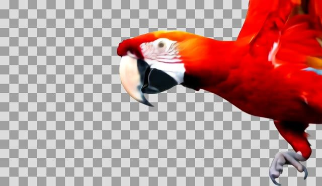</a></td><td align="center" width="36%"><a href="assets/readme/project-page/wan21-wan-alpha-v1-v2-ours.mp4">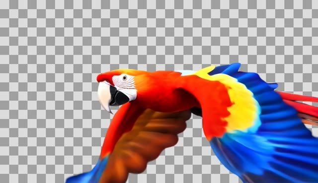</a></td></tr>
<tr><td width="28%"><strong>MagicTryOn</strong><br><sub>garment-preserving video virtual try-on</sub></td><td align="center" width="36%"><a href="assets/readme/project-page/wan21-magictryon-14b-v1-native.mp4"></a></td><td align="center" width="36%"><a href="assets/readme/project-page/wan21-magictryon-14b-v1-ours.mp4"></a></td></tr>
<tr><td width="28%"><strong>Fun-V1.1 Control-Camera</strong><br><sub>discrete camera-direction control</sub></td><td align="center" width="36%"><a href="assets/readme/project-page/wan21-wan2-1-fun-v1-1-14b-control-camera-native.mp4"></a></td><td align="center" width="36%"><a href="assets/readme/project-page/wan21-wan2-1-fun-v1-1-14b-control-camera-ours.mp4"></a></td></tr>
<tr><td width="28%"><strong>TheDenk Dilated ControlNet</strong><br><sub>video-to-video structural control</sub></td><td align="center" width="36%"><a href="assets/readme/project-page/wan21-thedenk-wan2-1-dilated-controlnet-canny-depth-hed-native.mp4"></a></td><td align="center" width="36%"><a href="assets/readme/project-page/wan21-thedenk-wan2-1-dilated-controlnet-canny-depth-hed-ours.mp4"></a></td></tr>
</table>

</details>

<details open>
<summary><strong>Wan2.2 · TI2V-5B — 5 selected cases</strong></summary>

<table>
<tr><th>Model / task</th><th>Native</th><th>LongLive-Plug</th></tr>
<tr><td width="28%"><strong>SCOPE</strong><br><sub>Action-controlled interactive worlds</sub></td><td align="center" width="36%"><a href="assets/readme/project-page/wan22-scope-native.mp4"></a></td><td align="center" width="36%"><a href="assets/readme/project-page/wan22-scope-ours.mp4"></a></td></tr>
<tr><td width="28%"><strong>FlashMotion</strong><br><sub>Trajectory-controlled image-to-video generation</sub></td><td align="center" width="36%"><a href="assets/readme/project-page/wan22-flashmotion-native.mp4"></a></td><td align="center" width="36%"><a href="assets/readme/project-page/wan22-flashmotion-ours.mp4"></a></td></tr>
<tr><td width="28%"><strong>Kiwi-Edit</strong><br><sub>Instruction and reference-guided video editing</sub></td><td align="center" width="36%"><a href="assets/readme/project-page/wan22-kiwi-edit-native.mp4">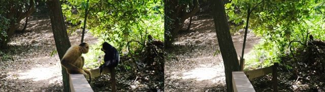</a></td><td align="center" width="36%"><a href="assets/readme/project-page/wan22-kiwi-edit-ours.mp4">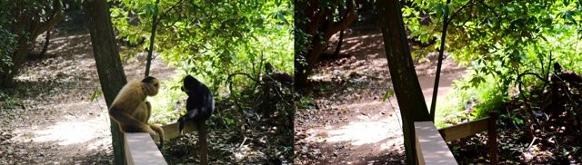</a></td></tr>
<tr><td width="28%"><strong>Matrix-Game 3.0</strong><br><sub>Long-horizon keyboard/mouse world model</sub></td><td align="center" width="36%"><a href="assets/readme/project-page/wan22-matrix-game-3-0-native.mp4"></a></td><td align="center" width="36%"><a href="assets/readme/project-page/wan22-matrix-game-3-0-ours.mp4"></a></td></tr>
<tr><td width="28%"><strong>Fun Control</strong><br><sub>Pose, Canny, depth, MLSD, trajectory control</sub></td><td align="center" width="36%"><a href="assets/readme/project-page/wan22-wan2-2-fun-5b-control-native.mp4">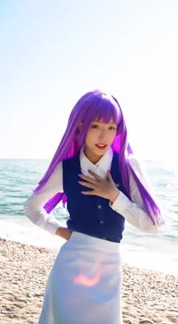</a></td><td align="center" width="36%"><a href="assets/readme/project-page/wan22-wan2-2-fun-5b-control-ours.mp4"></a></td></tr>
</table>

</details>

<details open>
<summary><strong>MiniMax-H3 · Audio-video — 5 selected cases</strong></summary>

<table>
<tr><th>Model / task</th><th>Native</th><th>LongLive-Plug</th></tr>
<tr><td width="28%"><strong>H3 ControlNet-Union</strong><br><sub>Structure-conditioned video generation</sub></td><td align="center" width="36%"><a href="assets/readme/project-page/h3-controlnet-native.mp4"></a></td><td align="center" width="36%"><a href="assets/readme/project-page/h3-controlnet-ours.mp4"></a></td></tr>
<tr><td width="28%"><strong>SolarWM-H3</strong><br><sub>Camera-controlled world generation</sub></td><td align="center" width="36%"><a href="assets/readme/project-page/h3-solarwm-native.mp4"></a></td><td align="center" width="36%"><a href="assets/readme/project-page/h3-solarwm-ours.mp4"></a></td></tr>
<tr><td width="28%"><strong>Viggle-Animate</strong><br><sub>Character animation from a driving video</sub></td><td align="center" width="36%"><a href="assets/readme/project-page/h3-viggle-native.mp4">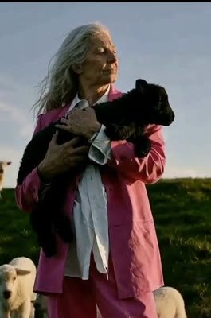</a></td><td align="center" width="36%"><a href="assets/readme/project-page/h3-viggle-ours.mp4">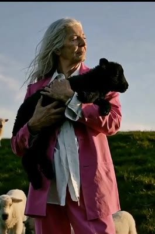</a></td></tr>
<tr><td width="28%"><strong>H3-World</strong><br><sub>Interactive world modeling</sub></td><td align="center" width="36%"><a href="assets/readme/project-page/h3-h3world-native.mp4">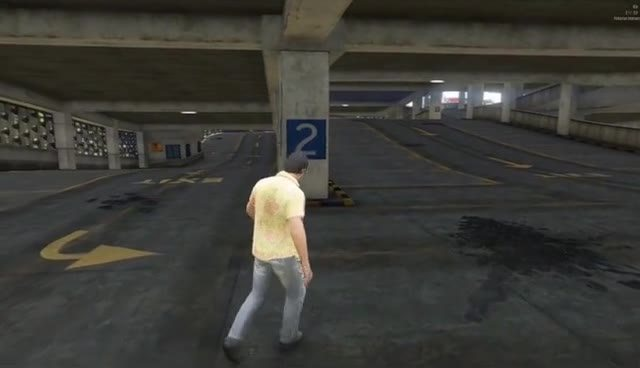</a></td><td align="center" width="36%"><a href="assets/readme/project-page/h3-h3world-ours.mp4">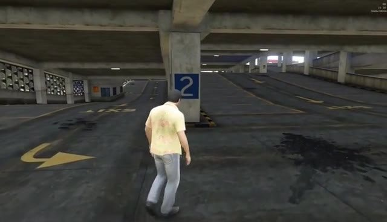</a></td></tr>
<tr><td width="28%"><strong>Code World Model</strong><br><sub>Multi-view world generation</sub></td><td align="center" width="36%"><a href="assets/readme/project-page/h3-cwm-native.mp4">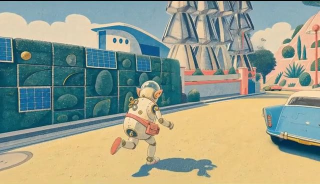</a></td><td align="center" width="36%"><a href="assets/readme/project-page/h3-cwm-ours.mp4">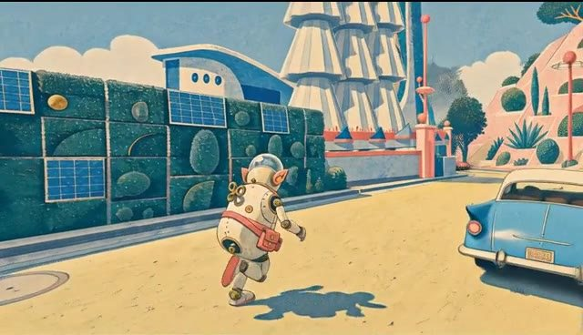</a></td></tr>
</table>

</details>

Each pair preserves the project page’s selected case, original video, poster and sampling setup. Native schedules vary. MiniMax-H3 uses its four-forward configuration; native Viggle-Animate already uses three forwards, so that case demonstrates transfer rather than acceleration. The paper evaluates 54 downstream models in total.

## Qualitative results

### Transferring acceleration across downstream tasks

<p align="center">
  
</p>

### Long-context generation

<p align="center">
  
</p>

## Getting Started

> **Note** — LongLive-Plug lives in the `LongLive-Plug/` directory of this repository.
> All commands on this page assume it is your working directory.

### How to install

Use Python 3.12 with CUDA-enabled PyTorch 2.9.1 and torchvision 0.24.1. Install the dependencies and download the base models and training prompts:

```bash
python -m pip install -r requirements.txt
python scripts/download_assets.py
```

### How to train

The following examples use the 5B recipe on a single machine with 16 GPUs.

Default training budgets are **250 iterations for CFG-only**, **600 for Wan2.1 Few-Step**, and **1,000 for Wan2.2 Few-Step**.

**Few-Step:**

Few-step training also uses CFG, which gives better results in our experiments than training without CFG. But We use the CFG only Lora branch to adjust.

```bash
torchrun --standalone --nproc_per_node=16 train.py \
  --config_path configs/wan22_dmd.yaml \
  --logdir runs/wan22_dmd/train --disable-wandb --no_visualize
```

**CFG-only:** prepare the teacher cache, then start training.

```bash
torchrun --standalone --nproc_per_node=16 scripts/cache_teacher.py \
  --config configs/wan22_cfg.yaml

torchrun --standalone --nproc_per_node=16 train.py \
  --config_path configs/wan22_cfg.yaml \
  --logdir runs/wan22_cfg/train --disable-wandb --no_visualize
```

Choose from the four recipes in [`configs/`](configs/). For multi-machine training, see the [training guide](docs/recipes.md#launch-training).

### How to run inference

Download a LoRA adapter and generate a video:

```bash
hf download Perflow-Shuai/Reproduce-Wan2.2-5B-CFG5-to-CFG1-50Step-LoRA-r64-iter500 \
  adapter_model.safetensors --local-dir adapters/wan22_cfg

python inference.py \
  --config configs/wan22_cfg.yaml \
  --checkpoint adapters/wan22_cfg/adapter_model.safetensors \
  --prompt "A compact silver robot walks through a clean robotics lab." \
  --output outputs/robot
```

Use the matching config and adapter for other models. Videos are saved to the output directory.

### Inference on downstream video models

Plug the Few-Step and CFG LoRA adapters into a downstream video model built on the same base model. **For downstream transfer, set the Few-Step LoRA weight to `1.0` and the CFG LoRA weight to `0.5` (Few-Step : CFG = `1 : 0.5`).** These are the adapter weights, not the model’s native CFG guidance scale.

## Citation

If you find this work useful, please consider citing:

```bibtex
@misc{yang2026longliveplug,
  title  = {LongLive-Plug: Once-for-All Distillation for Video Generation},
  author = {Shuai Yang and Luozhou Wang and Wei Huang and ZhiFei Chen and
            Bohan Zhang and Xiao Fu and Qianli Ma and Chen-Hsuan Lin and
            Weian Mao and Bryan Chu and Song Han and Yukang Chen},
  year   = {2026}
}
```

## License and Acknowledgements

Released under [Apache-2.0](LICENSE). This project builds on [LongLive](https://github.com/NVlabs/LongLive), Wan and Self-Forcing. See [acknowledgements and upstream licenses](THIRD_PARTY_NOTICES.md).
