<div align="center">

# LongLive-Plug
### Once-for-All Distillation for Video Generation

**Distill once on a base model. Plug into compatible downstream models.**

Shuai Yang<sup>&#42;</sup>, Luozhou Wang<sup>&#42;</sup>, Wei Huang, ZhiFei Chen,<br>
Bohan Zhang, Xiao Fu, Qianli Ma, Chen-Hsuan Lin,<br>
Weian Mao, Bryan Chu, Song Han, Yukang Chen

**NVIDIA** · <sup>&#42;</sup>Equal contribution


[](https://github.com/NVlabs/LongLive/tree/main/LongLive-Plug)
[](https://huggingface.co/collections/Efficient-Large-Model/longlive-plug)
[](https://nvlabs.github.io/LongLive/LongLive-Plug/)
[](https://youtu.be/pXNrJvBZvZU)

</div>

## 💡 TL;DR

**LongLive-Plug distills reusable capabilities into LoRA adapters once per backbone family, then transfers them to compatible downstream models without target-specific training.** It supports single-pass classifier-free guidance (CFG), few-step sampling, and long-context error correction for causal autoregressive generation.

<p align="center">
  <a href="https://youtu.be/pXNrJvBZvZU"></a><br>
  <em>Watch LongLive-Plug on YouTube.</em>
</p>

[Supported backbones](#supported-backbones) · [Highlights](#highlights) · [Introduction](#introduction) · [Getting started](#getting-started) · [Inference](#how-to-run-inference) · [Training](#how-to-train) · [Video gallery](#video-gallery) · [Qualitative results](#qualitative-results) · [Citation](#citation)

## Supported backbones

**LongLive-Plug currently supports three backbone families:**

1. **Wan2.1-14B**
2. **Wan2.2-TI2V-5B**
3. **MiniMax-H3**

Model downloads are available in the [Hugging Face collection](https://huggingface.co/collections/Efficient-Large-Model/longlive-plug). **Training code for MiniMax-H3 will be released later.**

Adapters are trained separately for each backbone and reused across compatible downstream models within that family. The video gallery below shows **eight selected downstream examples across the three backbones**.

## News

- **2026.09.28** — We release LongLive-Plug training and inference code with four recipes covering CFG and few-step distillation.

## Highlights

- **Once-for-all distillation.** Learn a capability on a base model and reuse it across compatible descendants, including models with added conditioning branches or expanded output channels.
- **Few-step generation with adjustable guidance.** Separate CFG and few-step LoRAs enable four-step generation while retaining guidance control through the CFG LoRA weight.
- **Reusable long-context correction.** Transfer long-context error correction to compatible models that support causal autoregressive inference.
- **Broad transfer coverage.** The paper evaluates 54 downstream models across three backbone families—Wan2.1-14B, Wan2.2-TI2V-5B, and MiniMax-H3—and eight task categories.

## Introduction

Specialized video models often repeat distillation for each new task. **LongLive-Plug** separates reusable capabilities from task-specific customization: train functional LoRAs on a base model, then attach them to compatible downstream models while retaining their task-specific weights.

<p align="center">
  
</p>

CFG and few-step distillation are decoupled, so guidance strength can be adjusted without rescaling the few-step adapter. Long-context distillation learns to correct errors accumulated during autoregressive rollouts. Reuse is scoped to compatible models within each backbone family; long-context transfer additionally requires causal autoregressive inference.

## Video gallery

**8 selected cases** from our [project page](https://nvlabs.github.io/LongLive/LongLive-Plug/), with the original native / LongLive-Plug video pair for each case. Click a thumbnail to open its video.

<details open>
<summary><strong>Wan2.1 · 14B — 3 selected cases</strong></summary>

<table>
<tr><th>Model / task</th><th>Native</th><th>LongLive-Plug</th></tr>
<tr><td width="28%"><strong>ABot-PhysWorld</strong><br><sub>Video prediction for robotic manipulation</sub></td><td align="center" width="36%"><a href="assets/readme/project-page/wan21-abot-physworld-native.mp4">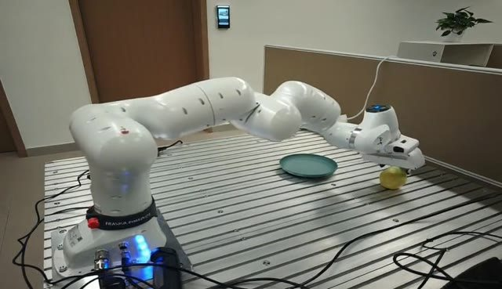</a></td><td align="center" width="36%"><a href="assets/readme/project-page/wan21-abot-physworld-ours.mp4">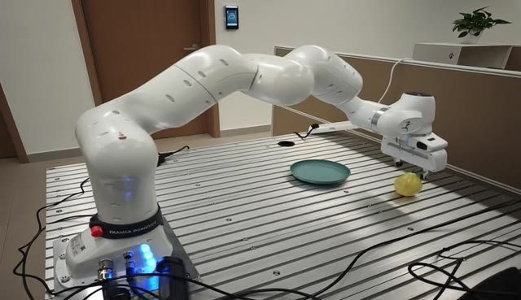</a></td></tr>
<tr><td width="28%"><strong>MagicTryOn</strong><br><sub>garment-preserving video virtual try-on</sub></td><td align="center" width="36%"><a href="assets/readme/project-page/wan21-magictryon-14b-v1-native.mp4"></a></td><td align="center" width="36%"><a href="assets/readme/project-page/wan21-magictryon-14b-v1-ours.mp4"></a></td></tr>
<tr><td width="28%"><strong>TheDenk Dilated ControlNet</strong><br><sub>video-to-video structural control</sub></td><td align="center" width="36%"><a href="assets/readme/project-page/wan21-thedenk-wan2-1-dilated-controlnet-canny-depth-hed-native.mp4">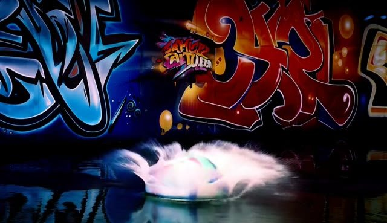</a></td><td align="center" width="36%"><a href="assets/readme/project-page/wan21-thedenk-wan2-1-dilated-controlnet-canny-depth-hed-ours.mp4">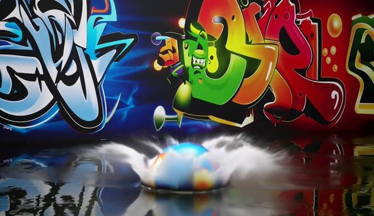</a></td></tr>
</table>

</details>

<details open>
<summary><strong>Wan2.2 · TI2V-5B — 3 selected cases</strong></summary>

<table>
<tr><th>Model / task</th><th>Native</th><th>LongLive-Plug</th></tr>
<tr><td width="28%"><strong>SCOPE</strong><br><sub>Action-controlled interactive worlds</sub></td><td align="center" width="36%"><a href="assets/readme/project-page/wan22-scope-native.mp4">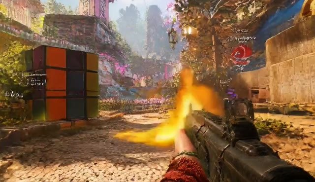</a></td><td align="center" width="36%"><a href="assets/readme/project-page/wan22-scope-ours.mp4">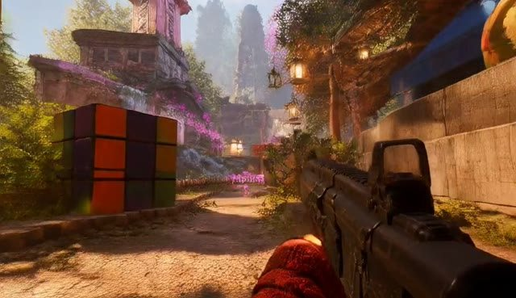</a></td></tr>
<tr><td width="28%"><strong>FlashMotion</strong><br><sub>Trajectory-controlled image-to-video generation</sub></td><td align="center" width="36%"><a href="assets/readme/project-page/wan22-flashmotion-native.mp4"></a></td><td align="center" width="36%"><a href="assets/readme/project-page/wan22-flashmotion-ours.mp4"></a></td></tr>
<tr><td width="28%"><strong>Matrix-Game 3.0</strong><br><sub>Long-horizon keyboard/mouse world model</sub></td><td align="center" width="36%"><a href="assets/readme/project-page/wan22-matrix-game-3-0-native.mp4">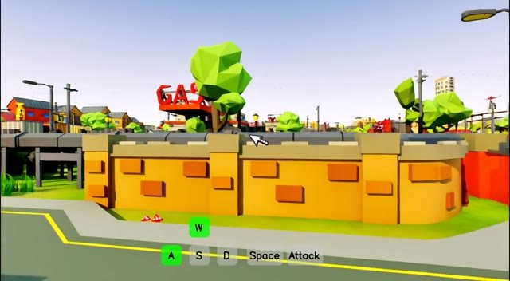</a></td><td align="center" width="36%"><a href="assets/readme/project-page/wan22-matrix-game-3-0-ours.mp4">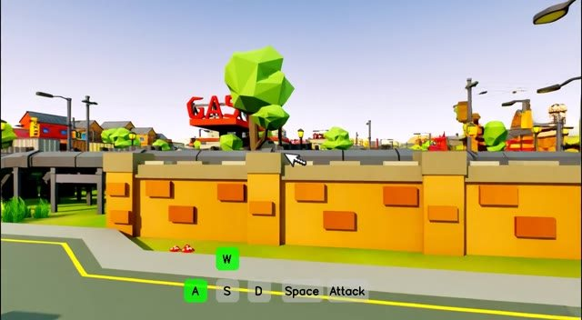</a></td></tr>
</table>

</details>

<details open>
<summary><strong>MiniMax-H3 · Audio-video — 2 selected cases</strong></summary>

<table>
<tr><th>Model / task</th><th>Native</th><th>LongLive-Plug</th></tr>
<tr><td width="28%"><strong>H3 ControlNet-Union</strong><br><sub>Structure-conditioned video generation</sub></td><td align="center" width="36%"><a href="assets/readme/project-page/h3-controlnet-native.mp4"></a></td><td align="center" width="36%"><a href="assets/readme/project-page/h3-controlnet-ours.mp4"></a></td></tr>
<tr><td width="28%"><strong>SolarWM-H3</strong><br><sub>Camera-controlled world generation</sub></td><td align="center" width="36%"><a href="assets/readme/project-page/h3-solarwm-native.mp4">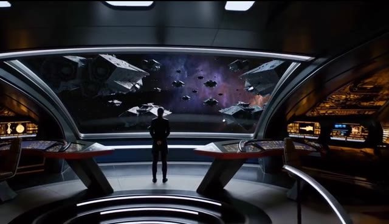</a></td><td align="center" width="36%"><a href="assets/readme/project-page/h3-solarwm-ours.mp4">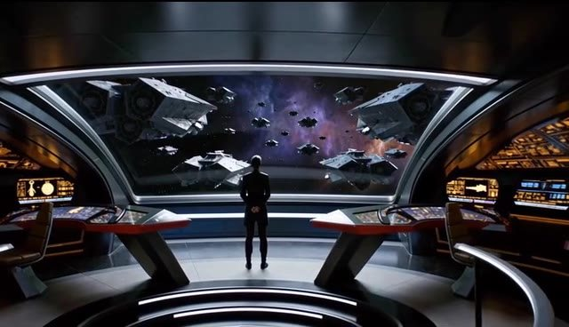</a></td></tr>
</table>

</details>

Each pair preserves the project page’s selected case, original video, poster and sampling setup. Native schedules vary. MiniMax-H3 uses its four-forward configuration. The paper evaluates 54 downstream models in total.

## Qualitative results

### Transferring acceleration across downstream tasks

<p align="center">
  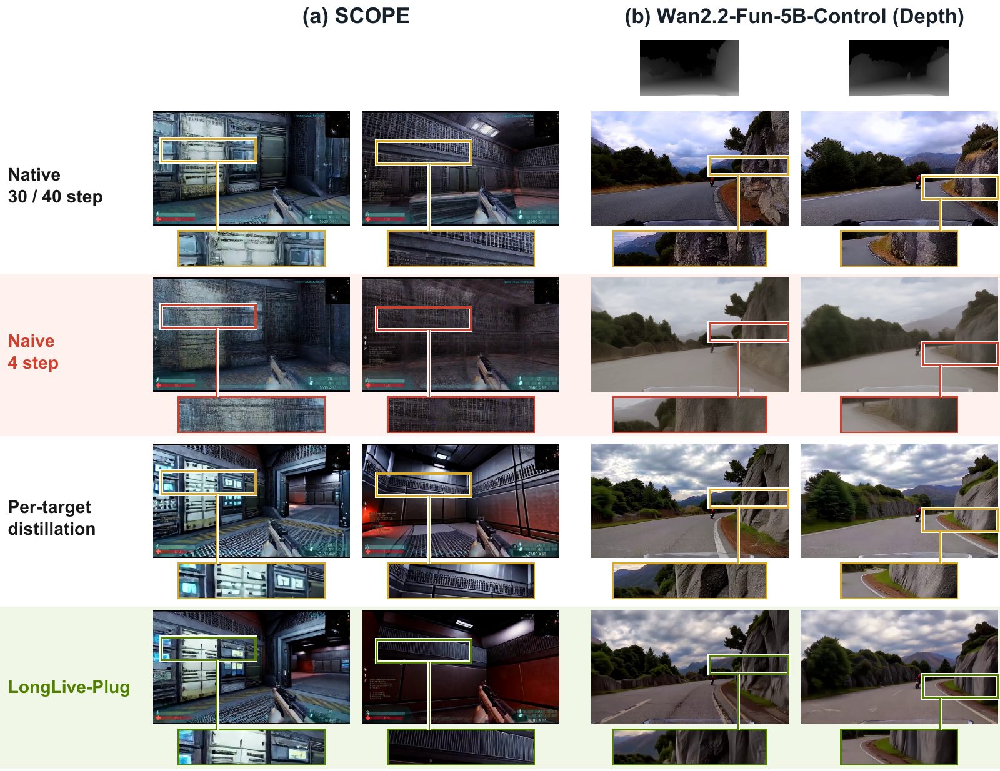
</p>

### Long-context generation

<p align="center">
  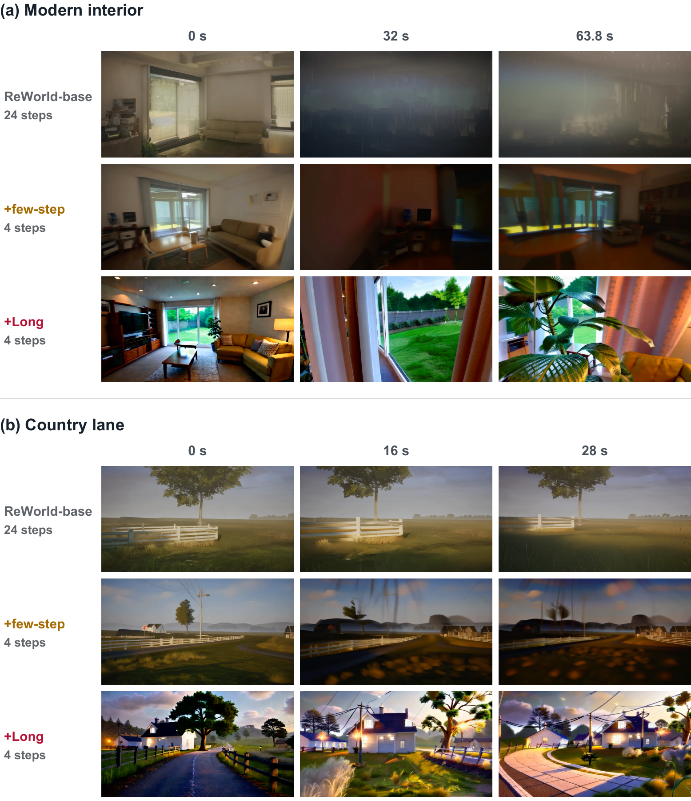
</p>

## Getting Started

> **Note** — LongLive-Plug lives in the `LongLive-Plug/` directory of this repository.
> All commands on this page assume it is your working directory.

### How to install

Use Python 3.12 with CUDA-enabled PyTorch 2.9.1 and torchvision 0.24.1. Install the dependencies and download the base models and training prompts:

```bash
python -m pip install -r requirements.txt
python scripts/download_assets.py
```

### How to run inference

For a base-model smoke test, download a CFG-only LoRA adapter and generate a video with its original 50-step schedule. For **4-step downstream inference**, see [transfer inference](#transfer-inference-on-downstream-video-models) below.

```bash
hf download Perflow-Shuai/Reproduce-Wan2.2-5B-CFG5-to-CFG1-50Step-LoRA-r64-iter500 \
  adapter_model.safetensors --local-dir adapters/wan22_cfg

python inference.py \
  --config configs/wan22_cfg.yaml \
  --checkpoint adapters/wan22_cfg/adapter_model.safetensors \
  --prompt "A compact silver robot walks through a clean robotics lab." \
  --output outputs/robot
```

Use the matching config and adapter for other models. Videos are saved to the output directory.

#### Transfer inference on downstream video models

Merge our **Few-Step LoRA at weight `1.0`** and **CFG LoRA at weight `0.5`** into a compatible downstream model, then run **4-step, CFG-free inference**. The CFG LoRA weight controls distilled guidance; the downstream sampler's native guidance scale should be **`1.0`**, with only the conditional forward pass at each step.

For example, use the Wan2.2-TI2V-5B adapters with [SCOPE](https://github.com/z2tong/SCOPE) for action-controlled worlds or FlashMotion for trajectory-controlled generation. Wan2.1-14B adapters can transfer to compatible models such as MagicTryOn and TheDenk Dilated ControlNet. Keep each model's task-specific inputs and conditioning, and select adapters from the **same backbone family** in our [model collection](https://huggingface.co/collections/Efficient-Large-Model/longlive-plug).

#### For agent

Copy this instruction into your coding agent in the downstream repository, replacing the local paths as needed:

```text
Integrate LongLive-Plug into SCOPE (https://github.com/z2tong/SCOPE).
Use the Wan2.2-TI2V-5B Few-Step and CFG LoRAs from the LongLive-Plug
model collection:
https://huggingface.co/collections/Efficient-Large-Model/longlive-plug

Merge the Few-Step LoRA with weight 1.0 and the CFG LoRA with weight 0.5
into the SCOPE DiT checkpoint. Check adapter key mapping, alpha/r scaling,
and tensor shapes; preserve SCOPE's action-conditioning weights.
Then update inference to use 4 denoising steps and cfg_scale=1.0,
skipping the unconditional forward pass. Keep image, keyboard/mouse
controls, and other task-specific inputs intact. Check the scheduler
against the matching LongLive-Plug few-step recipe.
Use LongLive-Plug/scripts/merge_lora.py for compatible Wan-named weights.
Save the merged checkpoint to a new path and provide the exact inference
command. Run a smoke test with an existing SCOPE example if a GPU and
weights are available; otherwise state what remains untested.
```

For another downstream model, replace SCOPE with its repository and select the matching backbone's adapters.

#### For manually merge

Download the matching **Few-Step** and **CFG** `adapter_model.safetensors` files from the model collection into `adapters/wan22_few_step/` and `adapters/wan22_cfg/`. Use [`scripts/merge_lora.py`](scripts/merge_lora.py) to merge them into the downstream DiT:

```bash
python scripts/merge_lora.py \
  --base /path/to/downstream/dit.safetensors \
  --few-step adapters/wan22_few_step/adapter_model.safetensors \
  --cfg adapters/wan22_cfg/adapter_model.safetensors \
  --few-step-weight 1.0 \
  --cfg-weight 0.5 \
  --output /path/to/merged/dit.safetensors
```

`--few-step-weight 1.0` and `--cfg-weight 0.5` are the defaults. The script applies `W_merged = W_downstream + 1.0 × ΔW_few_step + 0.5 × ΔW_cfg`, with `ΔW = (alpha / rank) × B @ A`. Released recipes use `alpha = rank`; for other adapters, pass their training values with `--few-step-alpha` and `--cfg-alpha`.

The script accepts one or more unquantized DiT safetensors files with native Wan parameter names, strips the PEFT `base_model.model.` adapter prefix, and checks every adapter target and shape. Downstream-only parameters are retained. It loads the DiT and adapters in CPU memory and writes a single safetensors file; allow enough RAM for those weights and FP32 per-layer merging. For renamed or reshaped backbones, convert the adapter keys/layout first. This helper targets the released Wan recipes.

**SCOPE example.** Merge its DiT shards into a new model directory:

```bash
python scripts/merge_lora.py \
  --base /path/to/SCOPE/model-*-of-*.safetensors \
  --few-step adapters/wan22_few_step/adapter_model.safetensors \
  --cfg adapters/wan22_cfg/adapter_model.safetensors \
  --output /path/to/SCOPE-LongLive-Plug/SCOPE.safetensors
```

Copy or symlink SCOPE's text encoder, VAE, and tokenizer into the new directory using its original layout. Keep only the merged `SCOPE.safetensors` as the SCOPE DiT there, because SCOPE's loader prefers `model-*-of-*.safetensors` if present.

In SCOPE's `inference.py`, add `cfg_scale=1.0` to the existing `video = pipe(...)` call. Its pipeline skips the unconditional branch at this value. Then run the following from the **SCOPE repository**:

```bash
python inference.py \
  --model_dir /path/to/SCOPE-LongLive-Plug \
  --input_image examples/example_0/image.png \
  --action_path examples/example_0/action.parquet \
  --prompt "First-person shooter perspective in a toy garden" \
  --num_inference_steps 4
```

Use the downstream model's own inference pipeline to load the merged checkpoint. LongLive-Plug's `inference.py --checkpoint` expects an adapter, not a merged model. The SCOPE instructions follow its [inference entry point](https://github.com/z2tong/SCOPE/blob/main/inference.py) and [pipeline](https://github.com/z2tong/SCOPE/blob/main/diffsynth/pipelines/scope_pipeline.py); they are an integration example, not an end-to-end GPU validation. Verify the downstream scheduler against the matching few-step recipe when adapting other pipelines.

### How to train

The following examples use the 5B recipe on a single machine with 16 GPUs.

Default training budgets are **250 iterations for CFG-only**, **600 for Wan2.1 Few-Step**, and **1,000 for Wan2.2 Few-Step**.

**Few-Step:**

Few-step training also uses CFG, which gives better results in our experiments than training without CFG. But We use the CFG only Lora branch to adjust.

```bash
torchrun --standalone --nproc_per_node=16 train.py \
  --config_path configs/wan22_dmd.yaml \
  --logdir runs/wan22_dmd/train --disable-wandb --no_visualize
```

**CFG-only:** prepare the teacher cache, then start training.

```bash
torchrun --standalone --nproc_per_node=16 scripts/cache_teacher.py \
  --config configs/wan22_cfg.yaml

torchrun --standalone --nproc_per_node=16 train.py \
  --config_path configs/wan22_cfg.yaml \
  --logdir runs/wan22_cfg/train --disable-wandb --no_visualize
```

Choose from the four recipes in [`configs/`](configs/). For multi-machine training, see the [training guide](docs/recipes.md#launch-training).

## Citation

If you find this work useful, please consider citing:

```bibtex
@misc{yang2026longliveplug,
  title  = {LongLive-Plug: Once-for-All Distillation for Video Generation},
  author = {Shuai Yang and Luozhou Wang and Wei Huang and ZhiFei Chen and
            Bohan Zhang and Xiao Fu and Qianli Ma and Chen-Hsuan Lin and
            Weian Mao and Bryan Chu and Song Han and Yukang Chen},
  year   = {2026}
}
```

## License and Acknowledgements

Released under [Apache-2.0](LICENSE). This project builds on [LongLive](https://github.com/NVlabs/LongLive), Wan and Self-Forcing. See [acknowledgements and upstream licenses](THIRD_PARTY_NOTICES.md).
