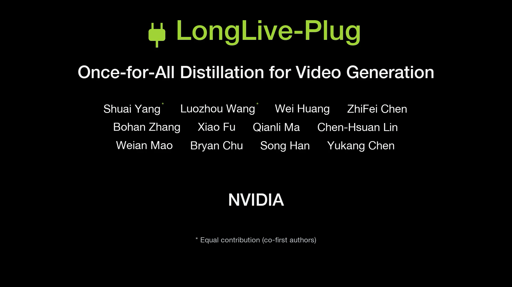
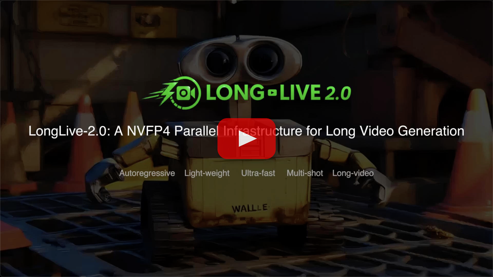
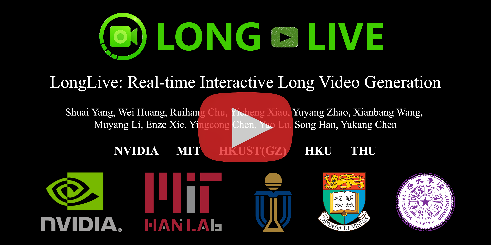
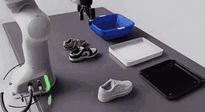
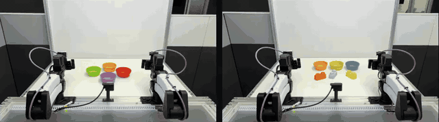
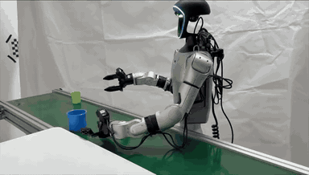
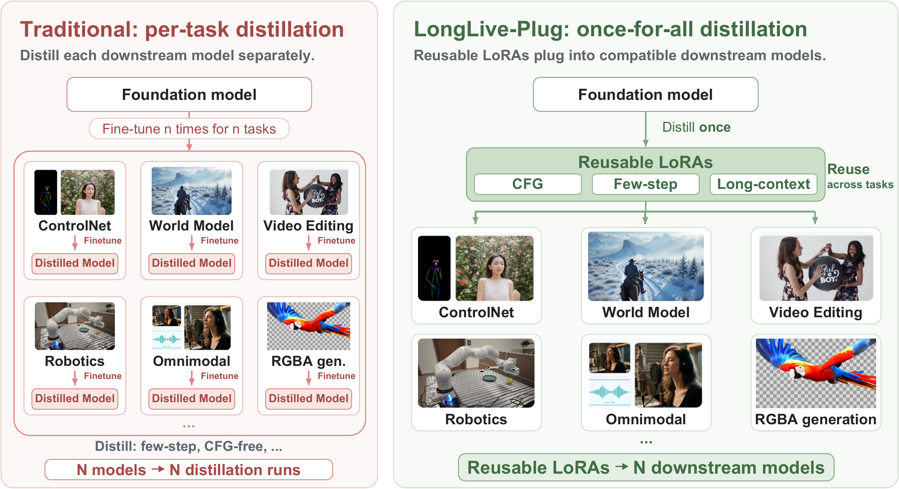
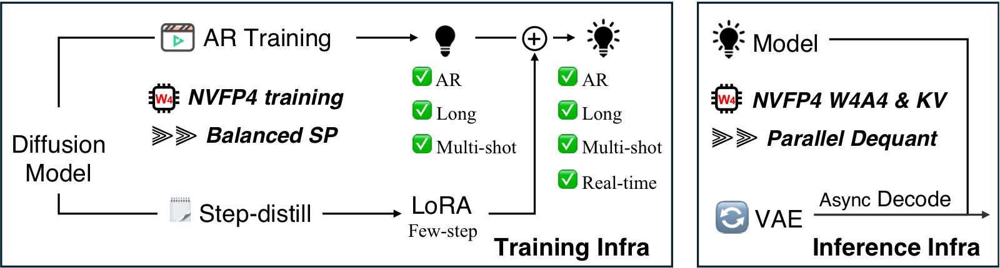
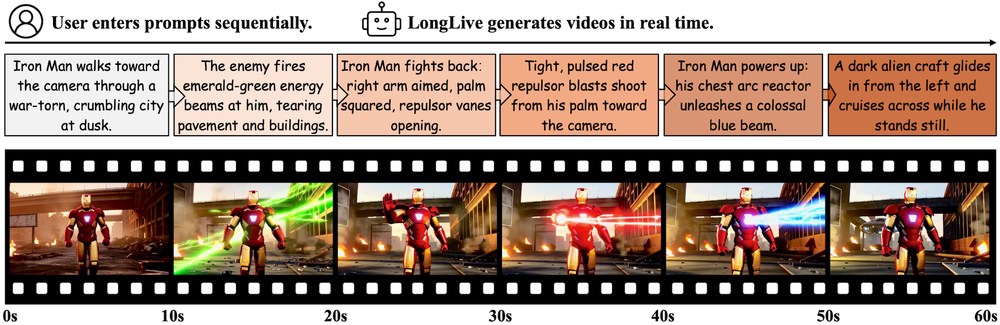

<!--
SPDX-FileCopyrightText: Copyright (c) 2026 NVIDIA CORPORATION & AFFILIATES. All rights reserved.
SPDX-License-Identifier: Apache-2.0
Provenance: Modified from NVlabs/LongLive.
Source: https://github.com/NVlabs/LongLive @ fb16a87 :: README.md
Changes: Add the independent Long-WAM project and its entry points.
-->

<p align="center" style="border-radius: 10px">
  
</p>

# 🎬 LongLive

**Long video generation and world-action modeling research from NVIDIA.**
Each project has its own directory, code, documentation and model weights.

[](https://arxiv.org/abs/2610.10528)
[](https://arxiv.org/abs/2609.38154)
[](https://arxiv.org/abs/2605.18739)
[](https://arxiv.org/abs/2509.22622)

[](https://nvlabs.github.io/LongLive/Long-WAM/)
[](https://nvlabs.github.io/LongLive/LongLive-Plug/)
[](https://nvlabs.github.io/LongLive/LongLive2/)
[](https://nvlabs.github.io/LongLive/)

## What's in this repository

| Directory | What it is | Use it when you want to | Venue |
| --- | --- | --- | --- |
| [**`Long-WAM/`**](Long-WAM) | Long-context world-action models | Train and evaluate robot policies, generate robot videos, or deploy on YAM, Franka and Unitree G1 | [arXiv](https://arxiv.org/abs/2610.10528) |
| [**`LongLive-Plug/`**](LongLive-Plug) | Once-for-all distillation for video generation | Distill a capability once on a base model and reuse it across downstream models, without retraining | [arXiv](https://arxiv.org/abs/2609.38154) |
| [**`LongLive2.0/`**](LongLive2.0) | An NVFP4 parallel infrastructure for long video generation | Train or serve long-video models fast, with NVFP4 quantization and sequence parallelism | arXiv |
| [**`LongLive1.0/`**](LongLive1.0) | Real-time interactive long video generation | Type prompts and watch a long video appear in real time, steered as you go | ICLR 2026 |

Each project is self-contained. Download only the project you need using partial
clone and sparse checkout; the example below selects **Long-WAM**.

```bash
git clone --filter=blob:none --sparse --single-branch --branch main --depth 1 https://github.com/NVlabs/LongLive.git
cd LongLive
git sparse-checkout set Long-WAM
cd Long-WAM
```

For another project, replace `Long-WAM` in the last two commands with
`LongLive-Plug`, `LongLive2.0` or `LongLive1.0`. Only the selected project and
shared root files are downloaded; no other project is required to run it.

## Demo videos

<table>
<tr>
<th width="25%" align="center">Long-WAM</th>
<th width="25%" align="center">LongLive-Plug</th>
<th width="25%" align="center">LongLive 2.0</th>
<th width="25%" align="center">LongLive 1.0</th>
</tr>
<tr>
<td width="25%" align="center">
  <a href="https://www.youtube.com/watch?v=sQGoMf6au1Y"></a>
</td>
<td width="25%" align="center">
  <a href="https://youtu.be/pXNrJvBZvZU"></a>
</td>
<td width="25%" align="center">
  <a href="https://www.youtube.com/watch?v=7oQALy32fiU"></a>
</td>
<td width="25%" align="center">
  <a href="https://www.youtube.com/watch?v=CO1QC7BNvig"></a>
</td>
</tr>
<tr>
<td width="25%" align="center"><sub>Long-context world-action models with streaming visual memory</sub></td>
<td width="25%" align="center"><sub>Once-for-all distillation: train a capability once, reuse it downstream</sub></td>
<td width="25%" align="center"><sub>NVFP4 parallel infrastructure for training and inference</sub></td>
<td width="25%" align="center"><sub>Real-time interactive long video generation</sub></td>
</tr>
</table>

<p align="center"><sub>Click a thumbnail to watch on YouTube.</sub></p>

## News

- 🔥 [2026.10.08] The [Long-WAM paper](https://arxiv.org/abs/2610.10528) is available on arXiv.
- 🔥 [2026.10.07] We release **Long-WAM**: long-context world-action models, robot-video pretraining, benchmark training/evaluation and real-robot deployment demos. → [`Long-WAM/`](Long-WAM) · [Project page](https://nvlabs.github.io/LongLive/Long-WAM/)
- 🔥 [2026.09.28] We release **LongLive-Plug** training and inference code with four recipes covering CFG and few-step distillation. → [`LongLive-Plug/`](LongLive-Plug)
- 🔥 [2026.07.08] LongLive 2.0 supports FP8 inference. Please refer to [here](LongLive2.0/README.md#fp8-ptq).
- 🔥 [2026.06.01] We released [LongLive-RAG](https://github.com/qixinhu11/LongLive-RAG), a general retrieval-augmented framework for long video gen.
- 🔥 [2026.05.30] LongLive 2.0 now supports I2V AR teacher-forcing training and I2V DMD distillation for Wan2.2-TI2V-5B.
- ⚡ [2026.05.25] We optimized the NVFP4 inference path with fused Triton RoPE/adaLN kernels, reduced KV-cache synchronization overhead, in-place quantized KV-cache updates, faster FP4 KV dequantization, pinned VAE transfers, and safer LoRA-before-quantization setup, improving overall throughput by **18.6%**.
- 🔥 [2026.05.13] We release **LongLive 2.0**, infra with NVFP4, parallelism and multi-shot for AR training, DMD distillation, and inference (⚡45.7 FPS).
- 🔥 [2026.04.12] LongLive supports kv cache compression with [TriAttention](https://github.com/WeianMao/triattention), with 50% KV reduction and no quality drop. Check it [here](https://github.com/WeianMao/triattention/tree/main/longlive)
- 🎉 [2026.01.27] LongLive is accepted by **ICLR-2026**.
- 🔥 [2026.01.11] LongLive supports adapting LongLive's original RoPE into KV-cache relative RoPE and generates infinite long videos!
- 🔥 [2025.11.03] We implement LongLive on linear attention model [SANA-Video](https://nvlabs.github.io/Sana/Video/)! Now SANA-Video can generate 60s interactive videos in real-time.
- 🔥 [2025.09.29] We release [Paper](https://arxiv.org/abs/2509.22622), this GitHub repo [LongLive](https://github.com/NVlabs/LongLive) with all training and inference code, the model weight [LongLive-1.3B](https://huggingface.co/Efficient-Large-Model/LongLive-1.3B), and demo page [Website](https://nvlabs.github.io/LongLive).


## Models

### Long-WAM

Public checkpoints on [Efficient-Large-Model](https://huggingface.co/Efficient-Large-Model).
See [download and inference instructions](Long-WAM/README.md#checkpoints).

| Model family | Released variants | Use |
| --- | --- | --- |
| Long-WAM LIBERO | [IDM](https://huggingface.co/Efficient-Large-Model/Long-WAM-LIBERO-IDM) · [COD](https://huggingface.co/Efficient-Large-Model/Long-WAM-LIBERO-COD) | LIBERO policy inference |
| Long-WAM RoboTwin 2.0 | [IDM](https://huggingface.co/Efficient-Large-Model/Long-WAM-RoboTwin2.0-IDM) · [COD](https://huggingface.co/Efficient-Large-Model/Long-WAM-RoboTwin2.0-COD) | RoboTwin 2.0 policy inference |
| Long-WAM RoboCasa GR1 | [0 s](https://huggingface.co/Efficient-Large-Model/Long-WAM-RoboCasa-GR1-0s) · [2.4 s](https://huggingface.co/Efficient-Large-Model/Long-WAM-RoboCasa-GR1-2.4s) · [4.8 s](https://huggingface.co/Efficient-Large-Model/Long-WAM-RoboCasa-GR1-4.8s) · [9.6 s](https://huggingface.co/Efficient-Large-Model/Long-WAM-RoboCasa-GR1-9.6s) · [19.2 s](https://huggingface.co/Efficient-Large-Model/Long-WAM-RoboCasa-GR1-19.2s) | Context-length scaling |
| Long-WAM RoboCasa365 | [RoboCasa365](https://huggingface.co/Efficient-Large-Model/Long-WAM-RoboCasa365) | Generalist kitchen policy |
| Long-WAM YAM | [YAM](https://huggingface.co/Efficient-Large-Model/Long-WAM-YAM) | Bimanual pretraining on ABC 130K |
| LongLive 2.0 Robot | [Robot-S](https://huggingface.co/Efficient-Large-Model/LongLive2.0-Robot-S) · [Robot-M](https://huggingface.co/Efficient-Large-Model/LongLive2.0-Robot-M) | Autoregressive robot-video generation |

### LongLive-Plug

[LongLive-Plug model collection](https://huggingface.co/collections/Efficient-Large-Model/longlive-plug)

| LongLive-Plug | Directory | Supported Models |
| --- | --- | --- |
| [LongLive-Plug-MiniMax-H3-few-step](https://huggingface.co/Efficient-Large-Model/LongLive-Plug-MiniMax-H3-few-step) | [`LongLive-Plug/`](LongLive-Plug) | H3-World, Code World Model, SolarWM-H3, Fun ControlNet-Union, LineartAnime, ... |
| [LongLive-Plug-MiniMax-H3-cfg](https://huggingface.co/Efficient-Large-Model/LongLive-Plug-MiniMax-H3-cfg) | [`LongLive-Plug/`](LongLive-Plug) | MiniMax-H3 (base model), SolarWM-H3 |
| [LongLive-Plug-Wan2.1-T2V-14B-few-step](https://huggingface.co/Efficient-Large-Model/LongLive-Plug-Wan2.1-T2V-14B-few-step) | [`LongLive-Plug/`](LongLive-Plug) | FantasyWorld, DreamZero, Fun Control, Wan-Move, MagicTryOn, ... |
| [LongLive-Plug-Wan2.1-T2V-14B-cfg](https://huggingface.co/Efficient-Large-Model/LongLive-Plug-Wan2.1-T2V-14B-cfg) | [`LongLive-Plug/`](LongLive-Plug) | FantasyWorld, DreamZero, Fun Control, Wan-Move, MagicTryOn, ... |
| [LongLive-Plug-Wan2.2-TI2V-5B-few-step](https://huggingface.co/Efficient-Large-Model/LongLive-Plug-Wan2.2-TI2V-5B-few-step) | [`LongLive-Plug/`](LongLive-Plug) | Matrix-Game 3.0, SCOPE, Fast-WAM LIBERO, Kiwi-Edit, Ovi, ... |
| [LongLive-Plug-Wan2.2-TI2V-5B-cfg](https://huggingface.co/Efficient-Large-Model/LongLive-Plug-Wan2.2-TI2V-5B-cfg) | [`LongLive-Plug/`](LongLive-Plug) | Matrix-Game 3.0, SCOPE, Fast-WAM LIBERO, Kiwi-Edit, Ovi, ... |

Model examples are from the paper appendix, **Complete Transfer Coverage and Additional Cases**; each row lists up to five examples. Wan coverage includes both few-step and CFG transfer. MiniMax-H3 few-step and CFG adapters are used separately.

### LongLive 2.0 and 1.0

| Model | Directory | FPS ↑ | Params | VBench ↑ | Multi-shot |
| --- | --- | ---: | ---: | ---: | :---: |
| [LongLive-2.0-5B](https://huggingface.co/Efficient-Large-Model/LongLive-2.0-5B) | [`LongLive2.0/`](LongLive2.0) | 24.8 | 5B | 85.06 | ✅ |
| [LongLive-2.0-5B-NVFP4-4Step](https://huggingface.co/Efficient-Large-Model/LongLive-2.0-5B-NVFP4-S4) | [`LongLive2.0/`](LongLive2.0) | 29.7 | 5B | 84.51 | ✅ |
| [LongLive-2.0-5B-NVFP4-2Step](https://huggingface.co/Efficient-Large-Model/LongLive-2.0-5B-NVFP4-S2) | [`LongLive2.0/`](LongLive2.0) | 45.7 | 5B | 83.14 | ✅ |
| [LongLive-1.3B](https://huggingface.co/Efficient-Large-Model/LongLive-1.3B) | [`LongLive1.0/`](LongLive1.0) | 20.7 | 1.3B | 84.87 |  |


## Long-WAM — Scaling the Context of World-Action Models

Long-context robot policies with streaming visual memory, built on LongLive 2.0
Robot video pretraining.

- **Benchmarks:** LIBERO, RoboTwin 2.0, Domino, RoboCasa GR1 and RoboCasa365.
- **Inference:** streaming IDM/COD, configurable Agentic API and image-to-video demos.
- **Deployment:** RTX 5090, DGX Spark and AGX Thor runtime profiles; YAM, Franka and Unitree G1 interfaces.

| Generated robot video | YAM long-horizon task | Unitree G1 cup stacking |
| --- | --- | --- |
| [](https://nvlabs.github.io/LongLive/Long-WAM/#demos) | [](https://nvlabs.github.io/LongLive/Long-WAM/#demos) | [](https://nvlabs.github.io/LongLive/Long-WAM/#demos) |

→ [Paper](https://arxiv.org/abs/2610.10528) · [Code and quick start](Long-WAM) · [Checkpoints](Long-WAM/README.md#checkpoints) ·
[Project page](https://nvlabs.github.io/LongLive/Long-WAM/) ·
[Video](https://www.youtube.com/watch?v=sQGoMf6au1Y)

## LongLive-Plug — Once-for-All Distillation for Video Generation

Separates reusable capabilities from task-specific customization: train
functional LoRAs on a base model, then attach them to compatible downstream
models while keeping those models' task-specific weights. Supports
Wan2.1-14B, Wan2.2-TI2V-5B and MiniMax-H3.

<p align="left" style="border-radius: 10px">
  
</p>

→ Code and documentation in [`LongLive-Plug/`](LongLive-Plug)
## LongLive 2.0 — An NVFP4 Parallel Infrastructure for Long Video Generation

Training and inference infrastructure built around NVFP4 quantization and
sequence parallelism.

- For training, it supports
  - [x] Balanced sequence parallel for T2V/I2V AR training (teacher-forcing).
  - [x] T2V/I2V AR training on multi-shot (or single-shot) videos.
  - [x] NVFP4 (or BF16) for both AR training and few-step distillation.
- For inference, it supports
  - [x] NVFP4 inference (W4A4) and NVFP4 KV Cache.
  - [x] TorchAO FP8 PTQ inference (W8A8) from the BF16 checkpoint.
  - [x] Multi-shot attention sink.
  - [x] Sequence parallel inference.
  - [x] Async decoding.

<p align="left" style="border-radius: 10px">
  
</p>

→ Code and documentation in [`LongLive2.0/`](LongLive2.0)

## LongLive 1.0 — Real-time Interactive Long Video Generation

Accepts sequential user prompts and generates the corresponding video in real
time, so a person can steer a long video while it is being produced. The key
ideas are the attention sink, KV-recache, and streaming long tuning.

<p align="left" style="border-radius: 10px">
  
</p>

→ Code and documentation in [`LongLive1.0/`](LongLive1.0)

## Awesome work using LongLive

- [DreamForge-World 0.1](https://trydreamforge.com/): Adapts the LongLive AR video stack with a residual action pathway for low-compute real-time controllable world modeling.
- [DreamX-World 1.0](https://arxiv.org/abs/2606.16993): Follows LongLive by adapting the model on long sequences with long rollouts and local temporal windows for stable long-horizon AR world generation.
- [SANA-Video](https://nvlabs.github.io/Sana/docs/longsana/): Combines SANA-Video with LongLive to build LongSANA, a real-time minute-long video generation variant with constant-memory KV cache.
- [Daydream Scope](https://docs.daydream.live/scope/reference/pipelines/longlive): Wraps LongLive as a streaming AR video diffusion pipeline for interactive text-to-video and video-to-video workflows.
- [MemFlow](https://github.com/KlingAIResearch/MemFlow): Builds on the LongLive codebase and adds adaptive memory retrieval for more consistent long narrative video generation.
- [ShotStream](https://github.com/KlingAIResearch/ShotStream): Builds on LongLive's distillation procedure for real-time streaming multi-shot AR video generation.
- [Stream-T1](https://github.com/FrameX-AI/Stream-T1): Builds on LongLive's codebase and algorithm, adding test-time scaling with noise propagation, reward pruning, and memory sinking.
- [KVPO](https://github.com/Richard-Zhang-AI/KVPO): Builds on LongLive and related AR video codebases to perform GRPO-style alignment through historical KV semantic exploration.
- [LoL](https://github.com/justincui03/LoL): Builds on LongLive to study and mitigate sink-collapse for ultra-long AR streaming video generation.
- [TriAttention](https://github.com/WeianMao/triattention/tree/main/longlive): Integrates trigonometric KV-cache compression into LongLive's causal inference pipeline, reducing KV memory inside LongLive's local-attention window.
- [StreamEdit](https://github.com/DSL-Lab/StreamEdit): Provides a `LongLive_StreamEdit` implementation for training-free streaming video editing built on the LongLive 1.0 codebase.
- [LongLive-RAG](https://github.com/qixinhu11/LongLive-RAG): A general retrieval-augmented framework for long video generation.
- [Streaming Autoregressive Video Generation via Diagonal Distillation](https://github.com/Sphere-AI-Lab/diagdistill): Builds on the LongLive codebase and supports direct initialization from `LongLive-1.3B` checkpoints for streaming AR video distillation.
- [Forcing-KV](https://github.com/zju-jiyicheng/Forcing-KV): Adds hybrid KV-cache compression to LongLive, including LongLive inference and interactive-generation scripts.
- [Dummy Forcing](https://github.com/csguoh/DummyForcing): Unifies Self-Forcing, LongLive, and Causal-Forcing pipelines with LongLive inference, VBench, and interactive-generation configs.
- [MemRoPE](https://github.com/YoungRaeKimm/MemRoPE): Uses LongLive as a supported base model for training-free infinite video generation with evolving memory tokens.
- [Astrolabe](https://github.com/franklinz233/Astrolabe): Supports LongLive as a distilled autoregressive video backbone with LongLive-specific RL configs and LoRA initialization.
- [OPSD-V](https://github.com/MeiGen-AI/OPSD-V): Post-trains LongLive with cache-aware on-policy self-distillation to improve long-horizon visual quality and motion dynamics while preserving its few-step autoregressive inference pipeline.

## License

Released under the [Apache License 2.0](LICENSE). Each directory also carries
its own copy of the license and, where applicable, its own third-party notices.

## Citation

Please consider citing our work if you find it useful:

[**Long-WAM: Scaling the Context of World-Action Models**](https://arxiv.org/abs/2610.10528)

```bibtex
@misc{huang2026longwamscalingcontextworldaction,
  title={Long-WAM: Scaling the Context of World-Action Models},
  author={Wei Huang and Bohan Zhang and Chenzhi Liu and Isabella Liu and
          Shuai Yang and Weian Mao and Luozhou Wang and Yicheng Xiao and
          Weifeng Lin and Qixin Hu and Bryan Chu and Sifei Liu and
          Linxi Fan and Xiaojuan Qi and Song Han and Yukang Chen},
  year={2026},
  eprint={2610.10528},
  archivePrefix={arXiv},
  primaryClass={cs.RO},
  url={https://arxiv.org/abs/2610.10528},
}
```

```bibtex
@misc{yang2026longliveplug,
  title  = {LongLive-Plug: Once-for-All Distillation for Video Generation},
  author = {Shuai Yang and Luozhou Wang and Wei Huang and ZhiFei Chen and
            Bohan Zhang and Xiao Fu and Qianli Ma and Chen-Hsuan Lin and
            Weian Mao and Bryan Chu and Song Han and Yukang Chen},
  year   = {2026}
}
```

```bibtex
@article{longlive_2.0,
  title={LongLive2.0: An NVFP4 Parallel Infrastructure for Long Video Generation},
  author={Chen, Yukang and Wang, Luozhou and Huang, Wei and Yang, Shuai and Zhang, Bohan and Xiao, Yicheng and Chu, Ruihang and Mao, Weian and Hu, Qixin and Liu, Shaoteng and Zhao, Yuyang and Mao, Huizi and Chen, Ying-Cong and Xie, Enze and Qi, Xiaojuan and Han, Song},
  journal={arXiv preprint arXiv: 2605.18739},
  year={2026}
}
```


```bibtex
@inproceedings{longlive,
    title={Longlive: Real-time interactive long video generation},
    author={Yang, Shuai and Huang, Wei and Chu, Ruihang and Xiao, Yicheng and Zhao, Yuyang and Wang, Xianbang and Li, Muyang and Xie, Enze and Chen, Yingcong and Lu, Yao and others},
    booktitle={ICLR},
    year={2026},
}
```


Related project:

```bibtex
@article{longlive_rag,
  title         = {LongLive-RAG: A General Retrieval-Augmented Framework for Long Video Generation},
  author        = {Hu, Qixin and Yang, Shuai and Huang, Wei and Han, Song and Chen, Yukang},
  journal       = {arXiv preprint arXiv:2606.02553},
  year          = {2026}
}
```

## Acknowledgement

- [Self-Forcing](https://github.com/guandeh17/Self-Forcing): the AR training codebase and formulation we build upon.
- [Wan2.1](https://github.com/Wan-Video/Wan2.1): the video diffusion backbone used in LongLive 1.0 and LongLive-Plug.
- [Wan2.2](https://github.com/Wan-Video/Wan2.2): the base video diffusion model components used in this release.
- [MiniMax-H3](https://github.com/MiniMax-AI/MiniMax-H3): the audio-video generation backbone used in LongLive-Plug.
